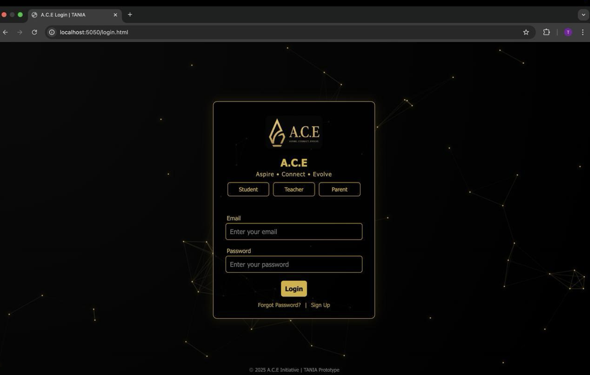
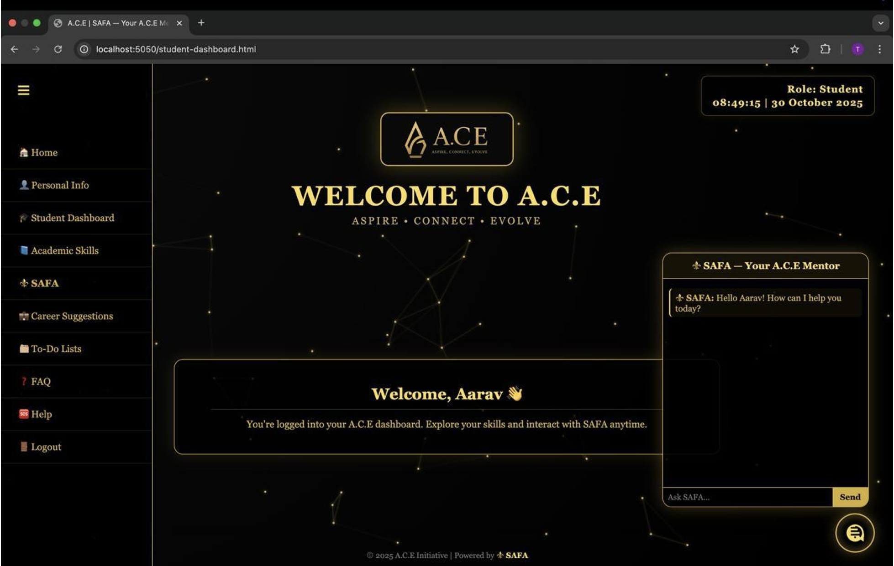
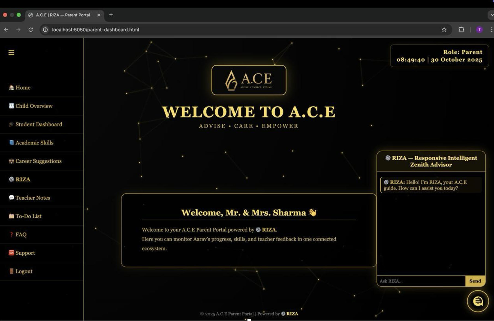
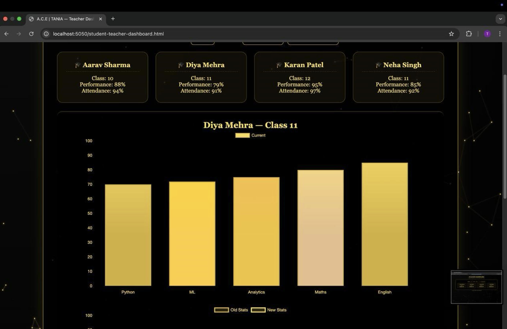
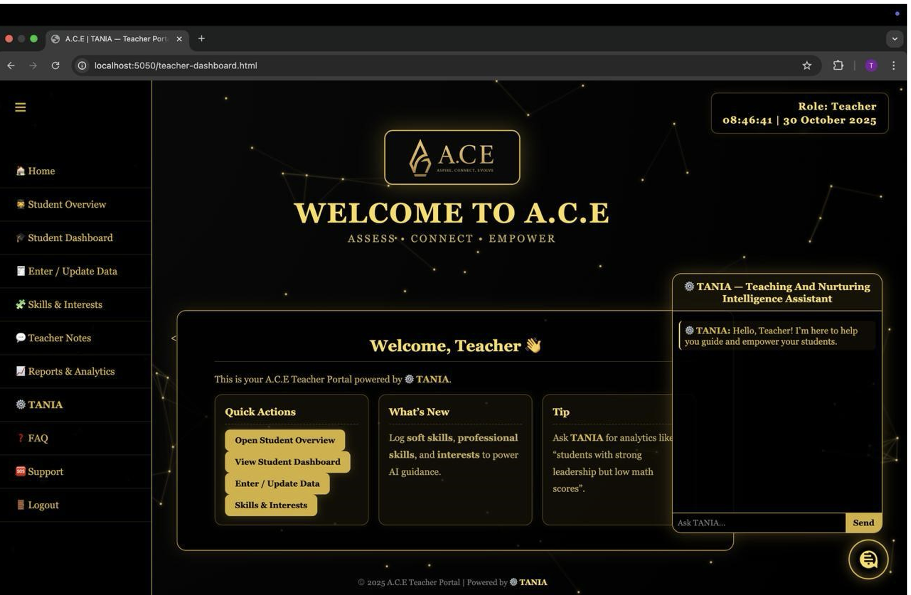

# A.C.E – Aspire. Connect. Evolve

AI-Powered Career Guidance Web Application

## Overview
A.C.E is an intelligent career guidance platform designed to provide personalized, data-driven recommendations using Artificial Intelligence and real-time market analytics.

This system bridges the gap between education and employability.

---

## Key Features
- AI-based career recommendation engine
- Career readiness score
- Verified institution & scholarship database
- Fraud detection using AI
- Role-based dashboards (Student / Teacher / Parent)
- Real-time market trend insights

---

## Tech Stack

**Frontend:** HTML, CSS, JavaScript, React  
**Backend:** Node.js, Express.js  
**Database:** MongoDB  
**AI Module:** Python, Scikit-Learn, FastAPI  
**Cloud:** AWS / GCP (Planned)

---

## System Architecture
Frontend → REST API (Node.js) → MongoDB  
AI Microservice (FastAPI) → Career Scoring Engine

---

## Academic Project
Final Year BCA Project – 2025  
Yenepoya Institute of Arts, Science, Commerce and Management  

---

## Developer
Tania Khalid
## UI Preview

### Login Page

### Student Dashboard

### Parent Dashboard

### Teacher Dashboard

### Analytics View

